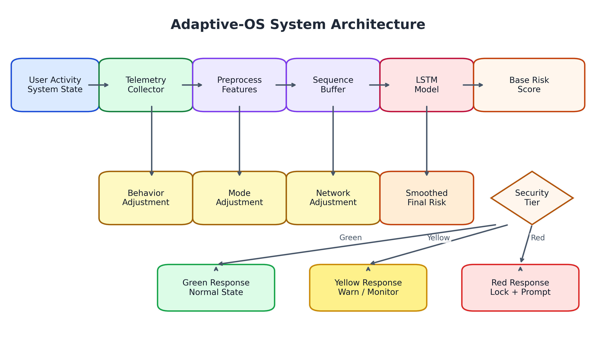
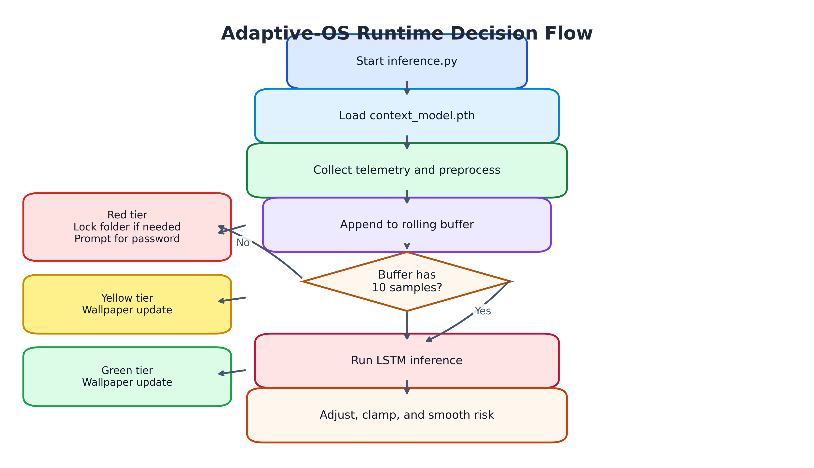
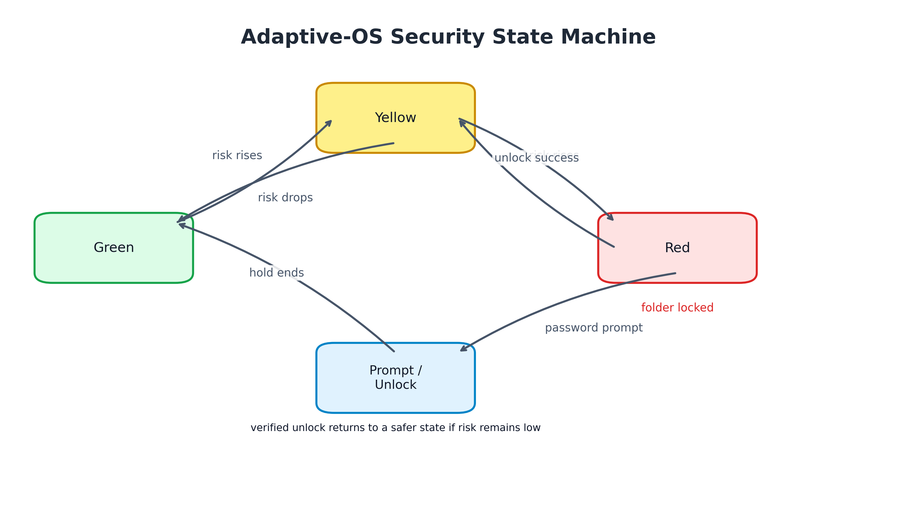
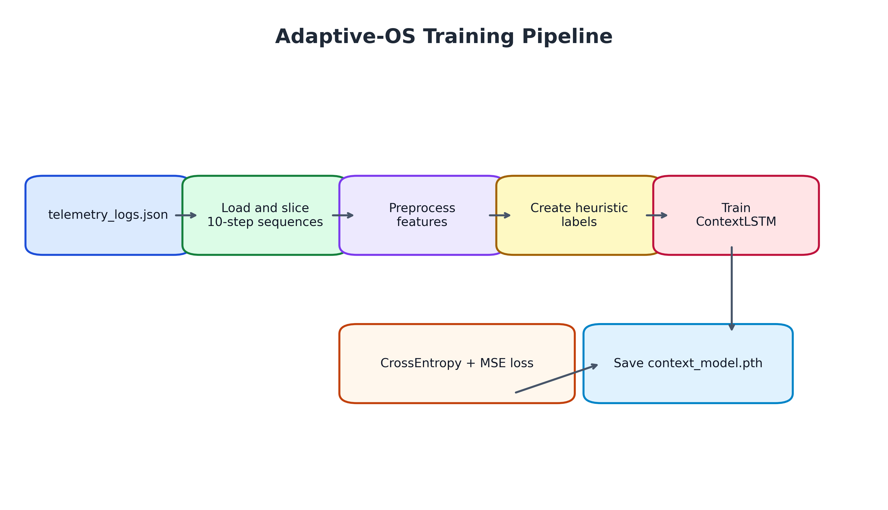

# Adaptive-OS Project Report

## 1. Project Title

Adaptive-OS: Context-Aware Security Monitoring and Adaptive Folder Protection Using Deep Learning

## 2. Problem Statement and Objective

The project addresses the problem of adapting security behavior based on live user and system context. Traditional static security tools apply the same policy regardless of whether a user is actively coding, browsing, gaming, or idle. That can create either unnecessary friction or weak protection.

The objective of Adaptive-OS is to observe behavioral and system telemetry in real time, infer a risk score with a deep learning model, and use that score to trigger adaptive responses. The response layer changes the wallpaper as a status signal and locks or unlocks a protected folder when risk becomes high.

## 3. Selected Deep Learning Approach

The selected deep learning approach is a Long Short-Term Memory network, implemented as `ContextLSTM` in [models/lstm_model.py](models/lstm_model.py). This choice fits the problem because security risk depends on patterns over time, not just on one isolated measurement.

The model has two outputs:

- A 3-class context prediction.
- A continuous risk prediction between 0 and 1.

This dual-output design lets the system represent both the current context and the estimated threat level.

## 4. Dataset Description

The project uses telemetry logs stored in `telemetry_logs.json`, which are loaded in [data/real_dataset.py](data/real_dataset.py). The dataset is formed by slicing the logs into 10-step sequences and converting each record into a 14-feature vector using [telemetry/preprocess.py](telemetry/preprocess.py).

The feature set includes:

- CPU usage
- Hour of day
- Typing speed
- Click rate
- One-hot encoded active application category
- One-hot encoded network category

The labels are generated heuristically from the average typing and click behavior of each sequence. That means the dataset is semi-synthetic at the label level, because it uses rule-based labels rather than manually verified ground truth.

## 5. Methodology

### 5.1 Data Preprocessing Steps

The preprocessing pipeline in [telemetry/preprocess.py](telemetry/preprocess.py) performs the following steps:

1. CPU and hour values are normalized to the range 0 to 1.
2. Typing speed and click rate are normalized.
3. The active application is converted into a one-hot vector.
4. The network name is converted into a one-hot vector.
5. The final feature vector is assembled into a 14-dimensional array.

During inference, the system buffers 10 consecutive feature vectors before sending them to the model in [inference.py](inference.py).

### 5.2 Model Architecture

The architecture in [models/lstm_model.py](models/lstm_model.py) is compact and suitable for sequence classification:

- Input: 14 features per time step
- Recurrent layer: LSTM with 32 hidden units
- Output head 1: Linear layer + Softmax for context classification
- Output head 2: Linear layer + Sigmoid for risk estimation

This structure allows the model to learn temporal dependencies and produce both categorical and continuous outputs.

### 5.3 Tools and Technologies Used

The main tools and technologies used in the project are:

- Python
- PyTorch for model training and inference
- NumPy for array handling
- psutil for system telemetry
- pynput for keyboard and mouse monitoring
- cryptography for folder encryption
- tkinter for password prompts
- rich for console-based status display
- Matplotlib for diagram generation in the report

The codebase is organized into separate modules for model logic, telemetry, security, and UI support.

### 5.4 Training Procedure

The training routine in [train.py](train.py) follows this sequence:

1. Load the dataset from [data/real_dataset.py](data/real_dataset.py).
2. Build the `ContextLSTM` model.
3. Use Adam optimization.
4. Train for 30 epochs.
5. Optimize with a combined loss:
   - Cross-entropy for context prediction
   - Mean squared error for risk prediction
6. Save the trained weights to `context_model.pth`.

### 5.5 Hyperparameter Settings

The project uses the following main hyperparameters and fixed settings:

| Setting | Value |
|---|---:|
| Input size | 14 |
| Sequence length | 10 |
| Hidden size | 32 |
| Number of context classes | 3 |
| Training epochs | 30 |
| Optimizer | Adam |
| Learning rate | 0.001 |
| Security prompt interval | 10 seconds |
| Unlock hold duration | 8 seconds |

Some threshold values are also hardcoded in [inference.py](inference.py), including the Green/Yellow/Red tier boundaries and heuristic risk adjustments.

### 5.6 Evaluation Metrics

The project uses two main learning objectives:

- Cross-entropy loss for the context classification output.
- Mean squared error for the continuous risk output.

For the runtime system, the practical evaluation metric is whether the risk score transitions into the correct security tier and whether the folder lock/unlock behavior matches the inferred risk.

## 6. Results and Output Screenshots / Graphs

The project produces visible outputs in two forms.

First, the runtime loop in [inference.py](inference.py) prints the current risk, tier, active mode, network name, typing speed, and click rate.

Second, the system changes the wallpaper based on the tier using [wallpaper_manager.py](wallpaper_manager.py), which gives a visible status signal.

For this report, the generated diagrams are included as figures from [report_diagrams](report_diagrams). They can be referenced in the document as Figure 1 through Figure 4.

Figure 1 shows the overall system architecture, Figure 2 shows the runtime decision flow, Figure 3 shows the security state machine, and Figure 4 shows the training pipeline.

If you want screenshots from the actual runtime, capture the console output and wallpaper changes while `inference.py` is running, then place them beside these graphs.

### Architecture Diagram

Figure 1. Adaptive-OS System Architecture

### Runtime Flow Diagram

Figure 2. Adaptive-OS Runtime Decision Flow

### Security State Machine

Figure 3. Adaptive-OS Security State Machine

### Training Pipeline

Figure 4. Adaptive-OS Training Pipeline

## 7. Performance Analysis / Discussion

The project performs well as a prototype because it connects telemetry, sequence modeling, and adaptive security actions in a single loop. The LSTM is a reasonable choice because it can model temporal behavior, which is important for detecting suspicious changes over time.

The most useful strength of the system is the closed loop between prediction and action. The model does not only generate a score; that score directly affects the system state. This makes the project more meaningful than a passive classification demo.

However, there are several limitations.

- The project is strongly tied to Windows-specific behavior in [telemetry/collector.py](telemetry/collector.py) and [wallpaper_manager.py](wallpaper_manager.py).
- The dataset labels are heuristic rather than ground truth.
- There is little separation between policy logic and runtime logic in [inference.py](inference.py).
- The crypto/authentication path contains a symbol mismatch in [auth_manager.py](auth_manager.py).
- There is no dedicated test suite or dependency file.

So the performance is acceptable for demonstration purposes, but not yet strong enough for production deployment.

## 8. Conclusion

Adaptive-OS is a promising adaptive-security prototype that combines deep learning, telemetry analysis, and encrypted folder protection. Its biggest value is the design idea: the system reacts to user context rather than applying a fixed policy.

At the same time, the project still has important implementation gaps. The current version needs better portability, cleaner integration, stronger error handling, and more rigorous evaluation before it can be considered production-ready.

Overall, the project is best described as a solid proof of concept with a clear research direction and visible security behavior.

## Appendix: Source Code

The main source files used in this project are:

- [train.py](train.py)
- [inference.py](inference.py)
- [auth_manager.py](auth_manager.py)
- [crypto_manager.py](crypto_manager.py)
- [wallpaper_manager.py](wallpaper_manager.py)
- [ui_display.py](ui_display.py)
- [models/lstm_model.py](models/lstm_model.py)
- [data/real_dataset.py](data/real_dataset.py)
- [data/generate_data.py](data/generate_data.py)
- [telemetry/collector.py](telemetry/collector.py)
- [telemetry/preprocess.py](telemetry/preprocess.py)
- [telemetry/logger.py](telemetry/logger.py)

Report images are stored in [report_diagrams](report_diagrams).
